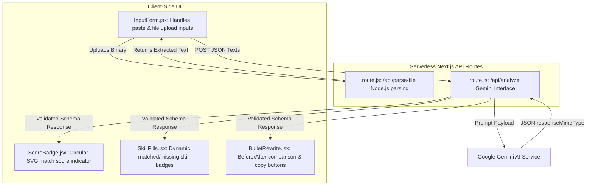

# GapCheck — AI-Powered Skill-Gap Analyzer

[](https://nextjs.org/)
[](https://react.dev/)
[](https://tailwindcss.com/)
[](https://aistudio.google.com/)
[](https://vercel.com/)
[](LICENSE)

**GapCheck** is a developer-centric, privacy-first single-page web application that compares a Job Description (JD) against your Resume and instantly calculates your compatibility. Powered by Google Gemini AI, it helps candidates analyze required competencies, diagnose missing qualifications, and receive optimized, quantified resume achievements tailored to applicant tracking systems (ATS).

---

## Features

- 🎯 **Holistic Match Score**: Get an instant compatibility rating (0-100) calculated using semantic context mapping rather than basic keyword counts.
- 🗂️ **Dual-Input Mechanics**: Paste plain text or directly drag and upload documents. Supports PDF (`.pdf`) and Word (`.docx`) file types.
- 🛡️ **Privacy-First (Stateless Session)**: No accounts, no cookies, no database tables. Your documents reside purely in volatile memory during the request lifetime and are never persisted or stored.
- 🔍 **Interactive Skill Gaps**: Highlights matching skills and ranks missing competencies by importance: Critical, Important, and Nice-to-have. Click any missing skill badge to expand a details card showing why the skill is requested.
- ✏️ **ATS-Tailored Resume Rewrites**: Extracts 3-5 weak resume points and provides side-by-side Before/After cards. It transforms passive bullets into active, quantified metrics that match the JD's target keywords.
- 📋 **Seamless Clipboard Copying**: Copies optimized bullet rewrites with a single click.
- ⚡ **Premium dark UI**: Utilizes an elegant dark-theme workspace with glassmorphic cards, smooth micro-animations, custom scrollbars, and animated skeleton loading placeholders.

---

## Screenshots

| Application Workspace | Interactive Analysis Results |
|:---:|:---:|
|  |  |

---

## Tech Stack

| Layer | Technologies | Purpose |
|---|---|---|
| **Core Framework** | Next.js 16.2.9 (App Router) | Static site generation, server-rendered components, and serverless API handlers. |
| **User Interface** | React 18 & Vanilla JSX | Responsive layout management and interactive state handling. |
| **Styling & Theme** | Tailwind CSS 3.4.1 | Custom colors, glassmorphic cards, and animated elements. |
| **Generative AI** | `@google/generative-ai` (Gemini 2.5 Flash Lite) | Structured JSON generation for skill gap analysis and resume rewriting. |
| **Document Parsers** | `pdf-parse` & `mammoth` | Extraction of plain text from uploaded files (PDFs and DOCX). |
| **Vector Icons** | `lucide-react` | Clean indicators and operational actions. |

---

## How It Works

GapCheck handles document files and text parsing within a fast, server-side data pipeline:

1. **Upload / Paste**: Users enter details directly or select file documents. 
2. **Text Extraction**: The app triggers `/api/parse-file` using a server-side buffer process. The parsed text auto-populates the input forms.
3. **LLM Validation**: The client issues a POST payload containing both blocks of text to `/api/analyze`.
4. **AI Generation**: The route uses Google's `gemini-2.5-flash-lite` model. The AI returns a JSON structure containing the score, skill listings, and bullet optimization details.
5. **Interactive UI Update**: Results load smoothly, and the user can copy optimized bullets or inspect missing skills.

---

## Project Architecture

The architecture separates concerns between React presentation states and serverless API routes:



For a comprehensive breakdown of compilation workarounds and design tokens, see the [Architecture Documentation](docs/ARCHITECTURE.md).

---

## Installation

Ensure you have [Node.js](https://nodejs.org/) installed (version `18.x` or higher is recommended).

1. Clone the project repository:
   ```bash
   git clone https://github.com/ikeshavvarshney/GapCheck.git
   cd GapCheck
   ```

2. Install the package dependencies:
   ```bash
   npm install
   ```

3. Create your local environment configuration file:
   ```bash
   cp .env.local.example .env.local
   ```

---

## Environment Variables

GapCheck requires a single environment variable to run. Open `.env.local` and add your Google Gemini API key:

| Variable | Required | Description | Link |
|---|---|---|---|
| `GEMINI_API_KEY` | **Yes** | Authenticates queries with the Google Gemini API. | [Google AI Studio Key Setup](https://aistudio.google.com/apikey) |

> [!WARNING]
> Never commit your `.env.local` file or push your API keys to public repositories on GitHub.

---

## Local Development

Start the local Next.js development server:

```bash
npm run dev
```

Open your browser to [http://localhost:3000](http://localhost:3000) to view the application interface.


---

## Deployment

GapCheck is designed to deploy to Vercel with zero additional configuration:

1. Push your repository code to GitHub.
2. Log into the [Vercel Dashboard](https://vercel.com) and click **"Add New Project"**.
3. Select your repository and import it.
4. Under the **Environment Variables** configuration section, add:
   - **Key**: `GEMINI_API_KEY`
   - **Value**: `[Your Gemini API Key]`
5. Click **"Deploy"**. Vercel will build the frontend assets and host the serverless functions automatically.

For deeper technical options, see the [Deployment & Operations Guide](docs/DEPLOYMENT.md).

---

## API Routes

### 1. File Upload Parser (`POST /api/parse-file`)
- **Content-Type**: `multipart/form-data`
- **Request Body**: `file` (PDF or DOCX document binary, max 5MB)
- **Response**: Extracted plain text.
  ```json
  { "text": "Extracted text content from document..." }
  ```

### 2. Resume Gap Analyzer (`POST /api/analyze`)
- **Content-Type**: `application/json`
- **Request Body**:
  ```json
  {
    "jdText": "Job Description text (100 - 6,000 characters)",
    "resumeText": "Resume text (100 - 6,000 characters)"
  }
  ```
- **Response**: Categorized skills and bullet rewrites.
  ```json
  {
    "matchScore": 75,
    "matchedSkills": ["Skill A", "Skill B"],
    "missingSkills": [
      { "skill": "Skill C", "importance": "critical", "reason": "Why it matters..." }
    ],
    "bulletRewrites": [
      { "before": "Old bullet point...", "after": "Optimized bullet point..." }
    ]
  }
  ```

For detailed status codes and error payloads, refer to the [API Reference Guide](docs/API_REFERENCE.md).

---

## Folder Structure

A high-level view of how files are structured in this repository:

```
gapcheck/
├── app/
│   ├── api/
│   │   ├── analyze/
│   │   │   └── route.js       # AI analysis API endpoint
│   │   └── parse-file/
│   │       └── route.js       # PDF & Word text parser API endpoint
│   ├── globals.css            # Custom CSS configurations & Tailwind imports
│   ├── layout.jsx             # Base app layout
│   └── page.jsx               # Single Page App layout orchestrator
├── components/
│   ├── BulletRewrite.jsx      # Resume bullet optimizations component
│   ├── ErrorState.jsx         # Validation and server error alerts
│   ├── Footer.jsx             # Attribution footer
│   ├── InputForm.jsx          # File upload & manual text input zones
│   ├── ScoreBadge.jsx         # Score gauge component
│   └── SkillPills.jsx         # Skill categorization badges
├── docs/                      # Technical references & guides
│   ├── API_REFERENCE.md
│   ├── ARCHITECTURE.md
│   ├── DEPLOYMENT.md
│   └── PROJECT_OVERVIEW.md
├── LICENSE                    # MIT license details
├── package.json               # Package configuration
└── tailwind.config.js         # Tailwind configuration rules
```

---

## Future Improvements

- [ ] **Interactive Resume Builder**: Allow editing rewritten bullets directly within the app before copying.
- [ ] **Multiple Resume Uploads**: Compare multiple versions of a resume against the same JD to find the best fit.
- [ ] **Direct PDF Export**: Generate a clean, polished PDF report of the skill-gap analysis.
- [ ] **Job Search Integration**: Suggest live job openings based on identified skill match scores.
- [ ] **Dark/Light Mode Toggle**: Provide users the option to switch between dark and light themes.

---

## Contributing

Contributions are welcome! If you want to improve GapCheck:

1. Fork this repository.
2. Create a branch for your feature (`git checkout -b feature/NewFeature`).
3. Commit your modifications (`git commit -m 'Add some feature'`).
4. Push the branch to your fork (`git push origin feature/NewFeature`).
5. Open a Pull Request detailing your changes.

---

## License

This project is licensed under the MIT License. See the [LICENSE](LICENSE) file for details.