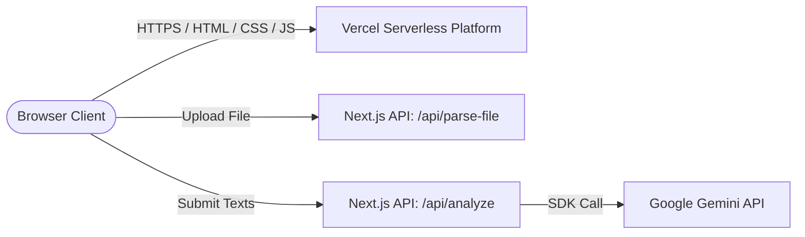
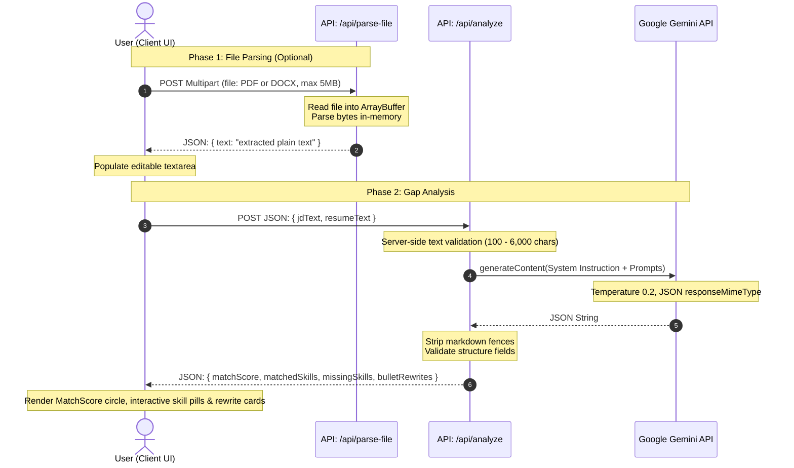

# Technical Architecture: GapCheck

This document outlines the technical design, system layout, client-server communications, and integration patterns of the GapCheck application.

---

## 1. System Topology

GapCheck is designed as a **stateless Next.js application** hosting both static page assets (compiled Client Components) and serverless API handlers in a single package. It requires no persistent datastore (database, file system, or caching layer), meaning it runs entirely in-memory on demand.



---

## 2. Directory Structure

The codebase is organized as follows:

```
gapcheck/
├── app/
│   ├── api/
│   │   ├── analyze/
│   │   │   └── route.js       # Core AI analysis serverless function
│   │   └── parse-file/
│   │       └── route.js       # PDF & Word processing serverless function
│   ├── globals.css            # Global CSS variables, custom Tailwind utilities
│   ├── layout.jsx             # HTML base layout, metadata, Inter font imports
│   └── page.jsx               # Main SPA orchestrator, handles skeletons & result cards
├── components/
│   ├── BulletRewrite.jsx      # Side-by-side Before/After resume bullet optimizer
│   ├── ErrorState.jsx         # Status-mapped error display cards
│   ├── Footer.jsx             # Footer with author links & Digital Heroes attribution
│   ├── InputForm.jsx          # File upload drop zones & textarea controllers
│   ├── ScoreBadge.jsx         # Circular animated SVG Match Score gauge
│   └── SkillPills.jsx         # Green matched pills & expandable missing skill accordions
├── public/                    # Static page assets
├── jsconfig.json              # Configures '@/*' alias resolving to project root
├── next.config.js             # Next.js framework configuration
├── package.json               # Node.js dependencies & custom scripts
├── postcss.config.js          # PostCSS processor configuration
└── tailwind.config.js         # Tailwind utility extension, colors, and keyframe setups
```

---

## 3. Client-Server Data Flow

When a user interacts with GapCheck, data travels through two distinct paths: **File Extraction Flow** and **AI Analysis Flow**.



---

## 4. Subsystem Deep Dive

### A. File Parsing Engine (`/api/parse-file/route.js`)
To provide PDF and Word text parsing inside serverless function execution, GapCheck implements two lightweight parsers that read document binaries in-memory:

1. **Word Document (`.docx`) Extraction**:
   - Handled via `mammoth`.
   - Utilizes `mammoth.extractRawText({ buffer })` to perform speed-focused extraction of raw paragraphs, ignoring styled layouts or tables to maximize speed.
2. **PDF Document (`.pdf`) Extraction**:
   - Handled via `pdf-parse`.
   - **Critical Workaround**: Standard imports of `pdf-parse` run a synchronous `readFileSync` on a test PDF file located inside its `node_modules` package root. In modern Next.js deployments, this causes compilation errors (e.g., `ENOENT` on `test/data/05-versions-space.pdf`). To bypass this behavior, the backend imports the parser file directly:
     ```javascript
     const pdfParse = (await import('pdf-parse/lib/pdf-parse.js')).default
     ```
   - Enforces `export const runtime = 'nodejs'` to ensure availability of native Node.js buffers and file handlers.

### B. Analysis Engine (`/api/analyze/route.js`)
The analysis route manages authentication and instructions for the Google Gemini API:

- **Model Selection**: `gemini-2.5-flash-lite` is used for ultra-low latency analyses without sacrificing reasoning accuracy.
- **Structured JSON Config**: The SDK call configures `responseMimeType: 'application/json'` to guarantee that the output complies with standard JSON structure.
- **Robust Parsing Fallback**: Includes string cleaning to handle potential markdown code blocks (` ```json ... ``` `) returned by older generation configurations:
  ```javascript
  const cleaned = responseText
    .replace(/^```json\s*/i, '')
    .replace(/^```\s*/i, '')
    .replace(/\s*```$/i, '')
    .trim()
  ```

---

## 5. UI and Design Tokens (`app/globals.css`)

GapCheck leverages a unified dark-mode-first aesthetic. It configures a series of design variables and custom classes extending standard Tailwind utilities:

| Token / Class | Implementation | Visual Purpose |
|---|---|---|
| `--color-bg` | `#0f0f1a` | Deep, modern dark navy workspace background |
| `--color-surface` | `#16162a` | Glass-card base color |
| `.glass-card` | `backdrop-filter: blur(16px); border: 1px solid rgba(99,102,241,0.15);` | Premium frosting design |
| `.gradient-text` | `linear-gradient(135deg, #818cf8 0%, #6366f1 50%, #4f46e5 100%)` | Distinctive branding for headings |
| `.glow-border` | `box-shadow` on focus / active container | Dynamic depth and visual guidance |
| `.skeleton` | `background: linear-gradient(...)` with `shimmer` animation | Smooth loading placeholders matching component structures |
