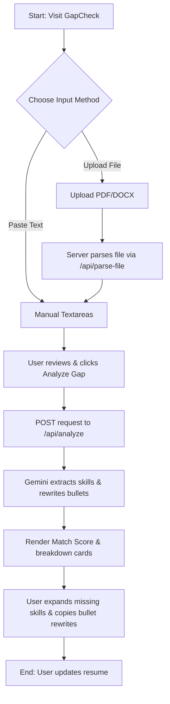

# Project Overview: GapCheck

**GapCheck** is a production-ready, privacy-first, web-based Job Description vs. Resume Skill-Gap Analyzer. Built with Next.js and Tailwind CSS, GapCheck leverages the Google Gemini API (`gemini-2.5-flash-lite`) to help job seekers optimize their resumes, align their experiences with target roles, and discover skill gaps before applying.

---

## The Core Value Proposition

In the modern job market, applicant tracking systems (ATS) and recruiters screen resumes heavily for specific competencies, keywords, and qualifications. Job seekers often struggle to align their resumes with complex job descriptions, leading to missed opportunities. 

GapCheck addresses this by:
1. **Highlighting Skill Mismatch**: Showing candidates exactly where their technical or soft skills fall short relative to the job requirements.
2. **Improving Resume Impact**: Translating weak or passive resume bullet points into high-impact, quantified achievements tailored to the target job description's language.
3. **Protecting Privacy**: Providing a stateless, registration-free interface that does not store resumes or personal details.

---

## Key Features

### 1. Holistic Match Score (0–100)
- Generates a realistic alignment score based on holistic JD-to-resume matching, avoiding naive keyword-counting.
- Visualized using a premium, custom SVG animated gauge with interactive glow effects.
- **Score Classification**:
  - **Strong Match** ($\ge 71$): Green badge. Indicates high alignment across critical domains.
  - **Partial Match** ($40–70$): Amber badge. Suggests candidate matches core skills but lacks secondary requirements.
  - **Weak Match** ($< 40$): Red badge. Highlights substantial gaps or misalignments in foundational skills.

### 2. Multi-Format Inputs (Paste & Upload)
- Users can paste text directly or upload document files.
- Supports PDF (`.pdf`) and Microsoft Word (`.docx`) file types.
- Client-side size checks restrict uploads to a maximum of 5MB.
- Seamlessly extracts text using serverless helper APIs and auto-fills the edit textareas, keeping the user in full control of their inputs.

### 3. Detailed Skill Gap Breakdown
- **Matched Skills**: Lists competencies identified in both the resume and the job description as success pills.
- **Skills to Develop**: Highlights missing qualifications, categorized by priority levels:
  - 🔴 **Critical**: Core to the role or mentioned repeatedly in the JD.
  - 🟡 **Important**: Expected competencies for standard execution.
  - 🔵 **Nice-to-have**: Optional bonuses or secondary technologies.
- **Interactive Explanations**: Users can click any missing skill pill to expand and view a custom description of why that skill is critical to the job requirements.

### 4. AI-Powered Resume Bullet Rewrites
- Identifies 3–5 weakly phrased bullets or experiences from the resume.
- Rewrites them to incorporate JD-specific keywords, action verbs, and quantitative impact.
- Provides a clean "Before vs. After" side-by-side card structure.
- Includes a one-click clipboard copying mechanism to let users integrate improvements directly into their actual resumes.

---

## User Workflow

1. **Upload or Input**: The user pastes a job description and their resume, or drops their files into the drag/upload zones.
2. **Text Verification**: Extracted text instantly populates the editable textareas. The user can fine-tune, add, or delete text as needed.
3. **Execution**: The user clicks the "Analyze Gap" action button.
4. **AI Generation**: A loading skeleton is rendered. An API request is sent to the server which queries the Gemini API.
5. **Interactive Review**: Results animate in, displaying the circular match gauge, interactive skill pills, and copyable rewrite comparisons.

---

## Architecture & Privacy Philosophy

- **Zero Data Retention**: The application does not utilize a database, database cache, or external storage. Resume and job description data reside in memory during the request lifetime and are discarded immediately.
- **Client-Driven Routing**: Built as a stateless single-page application.
- **Serverless Compute**: File parsing and Gemini AI API processing occur entirely within Next.js API route serverless functions.
- **Modern Aesthetics**: Leverages a deep space dark theme (`#0f0f1a`), glassmorphic layouts, animated SVG progress indicators, and custom Tailwind components.
